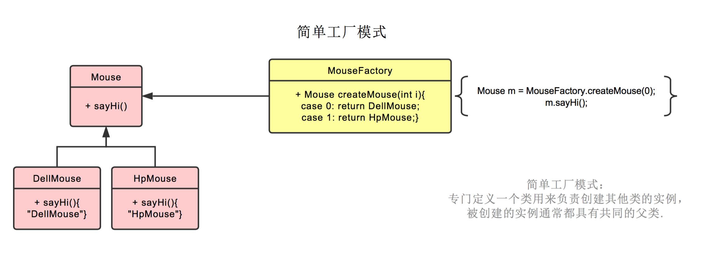
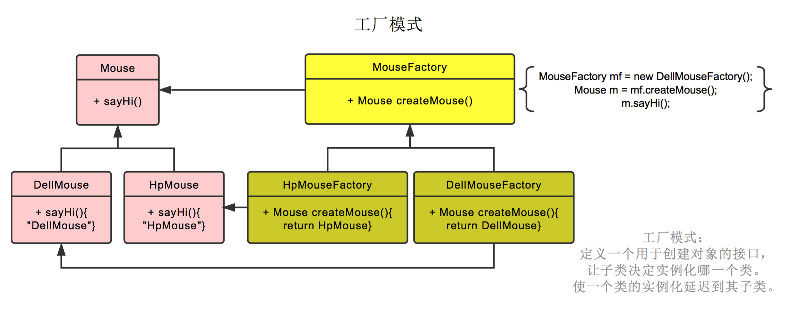
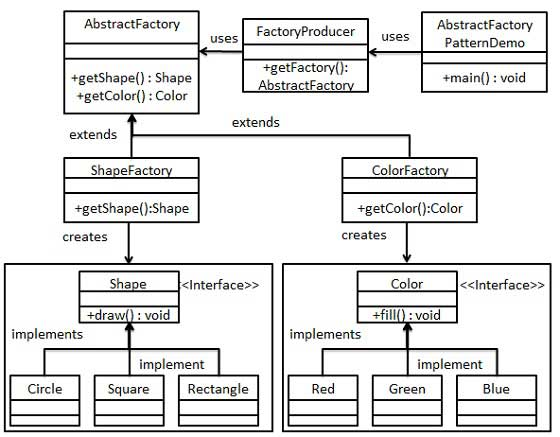
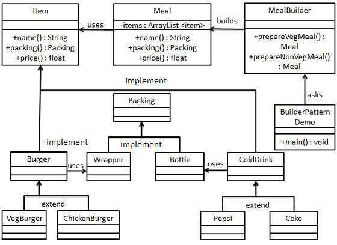

# 设计模式<->
## 简介
在软件工程中，设计模式一般只针对软件设计中给定条件下会重复发生的问题而提出的一种通用性的解决方案。

设计模式不是一种可以字节转化为代码的完整设计。多用于描述在不同情况下解决问题的通用方案。


**历史**

1. 模式是由土木工程师Christopher Alexander 提出的一种建筑学概念
2. 1987年 Kent Beck 和 Ward Cunningham首先将模式概念用于程序设计中
3. 1994年《设计模式：可复用面向对象软件的基础》，设计模式开始普及

**作用**
1. 提供了经过验证的行之有效的开发范式加快开发过程
2. 最优的软件设计实践需要能够预先考虑那些在应用过程中才会遇到的问题
3. 可复用的设计模式有助于预防重大的隐患问题，同事提高代码的可读性。复用性。

**分类**
不同领域，设计模式都有深入
- 用户界面
- 安全可用
- Web设计
- 商用模型
- 信息可视化
- 安全设计

GoF提出了23种设计模式，可大致分为三类

- 创造型设计模式
- 结构型设计模型
- 行为型设计模型


**创造型设计模式**

创造型设计模式注重于 **完成对象的实例化** ，相对于一般字节实例化对象，设计模式会根据实际情况有选择性地完成对象的实例化。这会为业务逻辑高度复杂化的情景提供足够的灵活性。

根据GoF的定义，创造型设计模型包括

- 抽象工厂设计模式
- 生成器设计模式
- 工程方法设计模式
- 原型设计模式
- 单例设计模式


**结构型设计模式**

结构型设计模式用于指导我们**完成代码结构的划分**，这样的结构设计能够让代码根据清晰和易于理解，提高整体的可维护性。

- 适配器设计模式
- 桥接设计模式
- 组合设计模式
- 装饰设计模式
- 门面设计模式
- 享元设计模式
- 代理设计模式


**行为设计模式**

行为型设计模式主要用于定义**对象之间的通信和控制流程**。其中主要的设计模式都非常注重优化对象间数据交互的方式

- 职责链设计模式
- 命令设计模式
- 解释器设计模式
- 迭代器设计模式
- 中介者设计模式
- 备忘录设计模式
- 观察者设计模式
- 策略设计模式
- 状态设计模式
- 模板方法设计模式
- 访问者设计模式


> 设计模式并不一定能带来高效的开发，当学习设计模式能有助于看懂源码。不一定非要把设计模式应用在开发中。软件开发的目标应该是
- 保持代码整洁
- 模块化
- 可读性


# 创造者模式

## 简介和分类

**1. 简介**
1. 关注类的实例化，也就是如何创建一个复杂类的实例
2. Java创建对象的基本方法是构造函数，如果一个对象创建需要几十个参数，或者创建过程需要适配几十种不同情况，则使用构造函数的设计就很复杂，要实现几十个参数的几十个不同构造函数。这是一个极端情况

创造者模式解决的就是这个问题，如将类的创建和类的功能分离的builder 模式


**2. 分类**

创造型模式包括以下子类别

- 对象创造型模式:主要完成对象的创建，并将对象中部分内容放到其他对象中创建。
- 类创造型模式:主要完成类实例化，并将类中的部分对象放到子类中创建。此类模式在实例化过程中高效李总了继承机制


> 所谓对象创建模式，就是对于某个可以直接new 的方式实例化的类。在Java中，一个类和接口也可以通过创建其子类或者实现类初始化（多态），这种就是类的创造型模式

创造型模式有五种设计模式

- 抽象工厂模式: 提供一个用于创建相关对象或相互以来对象的接口，无须指定对象的具体类
- 生成器模式: 它将复杂对象的构建语气表示相分离，使得在同样的构建过程种可以创建不同的表示.
（或者叫builder模式）
- 工程方法模式: 允许在子类中实现本类的实例化
- 原型模式: 使用一个原型实例指定创建对象的种类，然后通过拷贝这些原型实现新对象的创建
- 单例模式: 确保某个类在系统中有且仅有一个实例，并提供一个访问它的全局访问点


> ** java 中的几个关键字 **
>
> static 可以修饰方法、变量、代码块、内部类（静态内部类和嵌套内部类），static修饰的属性
- 变量前加 final : 表示此变量不可变
-  变量前加 static:
-  变量前加 static final
-  方法前加 static:
-  方法前加 static final
-  方法前加 void
-  代码块前加 static
-  内部类前加 static


### 工厂模式

工厂模式将对象的创建放在工厂中，用户创建时只需要创建工厂对象，再调用工厂对象提供的创建对象的方法，
如Create， getObject 既可以获取对象。对象的创建细节已经封装到工厂内部，用户无需关心。

工厂模式又分为几种
- 如果需要创建的对象是一种类别的产品，那么可以称之为工厂方法或简单工厂模式
- 如果需要创建的对象是一组相关或有依赖的产品，那么可以称之为抽象工厂模式
**第一种**

工厂只是简单封装对象创建的过程

```java
  public class ComplexClass {
    public ComplexClass(...) {
    }
  }

  public class Factory {
   public ComplexClass create(){
     // 复杂类的具体创建过程在这里
   }
  }
  public class ComplexClass {
    public ComplexClass(...) {
    }
  }

  public class Factory {
   public ComplexClass create(){
     // 复杂类的具体创建过程在这里
   }
  }
```

**第二种**
有多重类型的对象，工厂封装根据用户传入的类型，封装了所有创建的过程，返回同一个接口类型

```java
public interface Mouse{
  public String sayHi();
}

public class DellMouse implements Mouse{
 public String sayHi(){
   retrun "Bow Bow...."
}
}

public class HpMouse implements Mouse {
 public String sayHi(){
   retrun "Bow Bow...."
}
}

public class MouseFactory{

  public Pet createMouse(int i) {
    Mouse mouse = null;
    if(i.equals(1)){
      mouse = new DellMouse();
    } else{
      mouse = new HpMouse();
    }  
  }
}
```

**第三种**
为了扩展，在第二种中，在工厂里面创建了工厂要返回的所有的类型，但如果工厂生产的产品经常发生变化，就需要频繁更改工厂的对象获取方法。还有一种写法是，将工厂定义为一个抽象类（或接口），他的功能就是曾经一个Mouse类型的对象
对于某个产品来说，通过定义这个产品的工厂来创建这个产品的对象。有新的产品出来，就创建新的对象。

这种工厂创建的方法是很适合现实环境扩展的。在快速迭代开发过程中，产品类型是不断被研发出来的，按照设计模式的原则，尽量不改变源代码，这种模式就是一种典型的体现。
对象创建的过程被转化为，按照指定的工厂模板，实现新的工厂，在工厂里实现对象创建。

```java
// 定义产品的接口，产品的模板或者规范
public interface Mouse{
  public String sayHi();
}

// 定义一个具体的产品
public class DellMouse implements Mouse{
 public String sayHi(){
   retrun "Bow Bow...."
}
}

public class HPMouse implements Mouse {
 public String sayHi(){
   retrun "Bow Bow...."
}
}

// 定义一个接口
public interface class MouseFactory{

// 抽象工厂定义了工厂的功能就是创建一个Mouse对象
 public abstract Mouse createMouse();
}

// 具体产品工厂用于生产指定产品

public abstract class HPMouseFactory implements MouseFactory{

// 抽象工厂定义了工厂的功能就是创建一个Mouse对象
 @Override
 public abstract Mouse createMouse(){
    retrun new HPMouse();
 }
}
```

**第四种**
如果工厂是一个多样性的工厂，如联想，不仅生产鼠标，键盘，还生产电脑。也就说工厂生产的产品返回类型不是一种，而可能是多重，再这个工厂里，我想创建所有工厂目前能创建的产品时，就用到抽象工厂。抽象工厂说明了工厂能生产的所有产品。生产指定产品的具体工厂可以继承这个抽象工厂，并实现创建对象的方法

通过一个client，比如facotryProducer 来获取抽象工厂。通过判断用户传入的类型将所有可能创建的工厂进行封装，最后提供给用户的是client可以创建所有产品。

一般使用在： 系统的产品有多余一个的产品族，而系统只消费其中某一族的产品。


这里包括
- 产品定义
- 抽象工厂定义
- 产品对应工厂定义
- 工厂访问界面（获取指定产品的工厂）

优点： 当一个产品族中的多个对象被设计成一起工作时，它能保证客户端只使用一个产品族中的对象。
缺点： 产品族扩展非常困难，要增加一个系列的某个一产品，既要在抽象的Creator里加代码，又要在具体的产品工厂理解加代码。

使用场景：生成不同操作系统的程序。


### 生成器模式

生成器模式又叫建造者模式，或者builder模式。
目标是使用多个简单的对象一步一步的构建成一个复杂对象。通过将复杂的构建与其表示相分离。

在一个复杂系统中，一个对一个复杂对象的创建工作，其通常由各个部分的子对象用一定的算法构成。由于需求的变化，这个复杂部分的各个子对象也面临剧烈变化，但是将他们组合在一起的算法则相对稳定。

如一个复杂对象有10个复杂子对象构建而来。而在实际使用过程中的，有的需要用，有的不需要使用。
那么在这个类中创建一个内部的静态类Builder，builder静态创建的时候，就初始化返回这个对象，同事提供set 方法，供用户修改其他功能。这种方式就可以实现流式API。


另外一种是为了扩展性的设计。汽车有低端和高端的，怎么实现这个需求呢？
```JAVA
// 定义接口，（也可以使用抽象类，然后扩展），接口是一种模板，描述了行为（Java）

public interface CarPlan{
 public void setBase();
 public void setWheels();
  ...
}

// 定义产品
public class Car implements CarPlan{

}
// 定义car 的构造接口，说明car 是如何构造的
public interface CarBuilder{
  public void buildBase();
  public void buildWheels();
  public Car getCar();

}

// 定义低端车的构造器
public class LowPriceCarBuilder implements CarBuilder {

}

public class HighEndCarBuidler implements CarBuilder{

}

// 定义一个客户端，获取构造器，并返回车

public class CarFacade(){
  private CarBuilder carBuilder;

  public class CarFacade(CarBuilder carBuilder){
    this.carBuilder = carBuilder;
  }

    public Car build() {
      Car car = carbuider.getCar();
      carbuider.setBase();
      carBuilder.setWheels;
      return car
    }
}


main {
 // 先指明用什么builder，再build car

   CarBuilder carBuilder = new HighEndCarBuidler();
   CarFacade f = new CarFacade(carbuider);

    f.build();
}

```
这种模式下，构造器隐藏了产品构建过程中内部细节，各个构造器都是相互独立的。这提高了代码的模块化，并使其他生成器更方便的创建对象。


### 单例模式

- 单例类只能有一个实例
- 单例类必须自己创建自己的唯一实例
- 单例类必须给其他其他对象提供这一实例

单例模式保证一个雷仅有一个实例，并提供一个访问它的全局访问点。主要解决了一个全局使用类频繁创建和销毁的问题，节省系统资源。通过私有化构造函数，判断是否有当前实例，如果没有就创建的方式实现。

优点是：节省了资源，没有接口，不能继承，与单一职责原则冲突，一个类应该只关心内部逻辑不关心外面怎么来实例化。这就是理想落地的差距。为了节省性能，跑的更快。

单例模式主要解决的是多线程的是多线程访问的问题，以及多线程访问性能

有几种方式

- 懒汉式的，线程不安全
- 懒汉式的，线程安全
- 饿汉式
- 双重校验锁
- 登记式/静态内部类
- 枚举

```JAVA
//--1 lazy初始化，线程不安全，
public class Singleton {  
    private static Singleton instance;  
    private Singleton (){}  

    public static Singleton getInstance() {  
    if (instance == null) {  
        instance = new Singleton();  
    }  
    return instance;  
    }  
}


//--2 lazy初始化，线程安全，锁加在获取实例上，每次获取都加锁，互斥访问性能低。（线程并发到这里都需要同步等待）
public class Singleton {  
    private static Singleton instance;  
    private Singleton (){}  
    public static synchronized Singleton getInstance() {  
    if (instance == null) {  
        instance = new Singleton();  
    }  
    return instance;  
    }  
}
//-3 非lazy初始化，线程安全， 实例是成员变量，在类装载的时候就初始化，但导致类装载的原因很多。所有不是lazy 初始化。因为累装载之后只有一个实例，因为没有加锁，所以性能很高。但是类加载的时候就初始化，可能没用到，也带来浪费内存的问题。
public class Singleton {  
    private static Singleton instance = new Singleton();  
    private Singleton (){}  
    public static Singleton getInstance() {  
    return instance;  
    }  
}

//--4 lazy初始化，线程安全 通过volatile 和创建对象块上加锁，实现复杂但性能高。
public class Singleton {  
   // volatile 说明了一个线程修改了这个值，这个新值对其他线程立刻可见
    private volatile static Singleton singleton;  
    private Singleton (){}  
    public static Singleton getSingleton() {  
    if (singleton == null) {  
        synchronized (Singleton.class) {  
        if (singleton == null) {  
            singleton = new Singleton();  
        }  
        }  
    }  
    return singleton;  
    }  
}

//--5
public class Singleton {  
    private static class SingletonHolder {  
    private static final Singleton INSTANCE = new Singleton();  
    }  
    private Singleton (){}  
    public static final Singleton getInstance() {  
    return SingletonHolder.INSTANCE;  
    }  
}

//---6
public enum Singleton {  
    INSTANCE;  
    public void whateverMethod() {  
    }  
}
```
经验之谈：一般情况下，不建议使用第 1 种和第 2 种懒汉方式，建议使用第 3 种饿汉方式。只有在要明确实现 lazy loading 效果时，才会使用第 5 种登记方式。如果涉及到反序列化创建对象时，可以尝试使用第 6 种枚举方式。如果有其他特殊的需求，可以考虑使用第 4 种双检锁方式。

所谓Lazy 初始化，是使用的时候才初始化，所以1,2是lazy初始化。

### 原型模式
用户创建重复的对象，通过对象克隆的方式创建对象。利用已有的的一个原型对象，克隆之后，修改属性，生产一个新实例。


问题：所有属性有基本类型和引用类型。基本类型可变，引用类型一旦发生变化，这个对象也变化。

---引入新的问题，深拷贝，浅拷贝
- 浅拷贝：没有复制对象，只复制对象的引用，一旦原对象改变，新对象也改变
- 深拷贝：复制对象，并修改属性值。但也会存在引用类型的问题

实现克隆操作，在 JAVA 继承 Cloneable，重写 clone() 实现原型模式。

优点是：性能提高，缺点是：逃避了构造函数的约束。

因为创建对象需要很多资源，拷贝对象，再去修改能节省大量资源，特别是对象特别复杂，构造资源特别多的时候。

与通过对一个类进行实例化来构造新对象不同的是，原型模式是通过拷贝一个现有对象生成新对象的。浅拷贝实现 Cloneable，重写，深拷贝是通过实现 Serializable 读取二进制流。


```JAVA
public Object deepClone() throws IOException, OptionalDataException,
             ClassNotFoundException {
         // 将对象写到流里
         ByteArrayOutputStream bo = new ByteArrayOutputStream();
         ObjectOutputStream oo = new ObjectOutputStream(bo);
         oo.writeObject(this);
        // 从流里读出来
        ByteArrayInputStream bi = new ByteArrayInputStream(bo.toByteArray());
        ObjectInputStream oi = new ObjectInputStream(bi);
         return (oi.readObject());
     }
```
要想序列化对象，必须先创建一个OutputStream，然后把它嵌入ObjectOutputStream。这时就能用writeObject()方法把对象写入OutputStream。读的时候需要把InputStream嵌到ObjectInputStream中，然后再调用readObject()方法。不过这样读出来的只是一个Object的reference，因此，在用之前，还要下转型。

对象序列化不仅能保存对象的副本，而且会跟着对象中的reference把它所引用的对象也保存起来，然后再继续跟踪那些对象的reference，以此类推。这种情形常被称作”单个对象所联结的‘对象网’ “。

但是串行化却很耗时，在一些框架中，我们便可以感受到，它们往往将对象进行串行化后进行传递，耗时较多。


## 未完待续

1. 结构型设计模式：解决代码如何组织的问题
2. 行为型设计模式：解决对象之间的通信和控制流程
